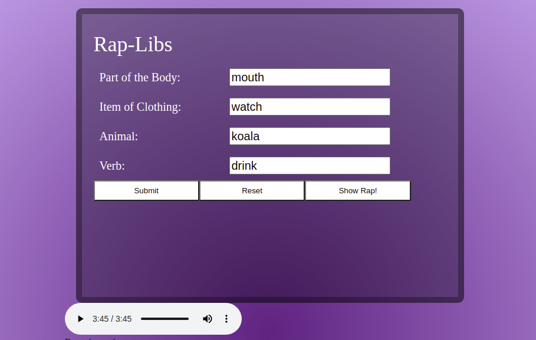

# Welcome to Rap-Libs
## What is it?

Rap-Libs is a mad-lib style rap generator. Type in some responses and see where it goes...

## Screen Shot



## Why this project?

This project needed to be built with React. Instead of building one of the more standard clone that have a thousand guides, I pick something that I would have to struggle with and figure out on my own. I definitely struggled and learned a lot in the process.

## Technologies 
- HTML
- CSS
- JavaScript
- React

## APIs
#### Rhyme Brain API : https://rhymebrain.com/api.html
I ended up using Rhyme Brain after starting with WordsAPI. After looking at the info below, which would you choose? For me and my needs, Rhyme Brain was the winner. 
|                        | Rhyme Brain | WordsAPI   |
| ----                   | ----        | ----       |
| Cost                   | Free        | FreeIsh*   |
| Call Rate Limit        | 350/hr      | 2,500/day  |
| Key Required           | No          | Yes        |
| Quality of Return Data | High        | Medium/Low |

*WordsAPI is free under 2,500 calls per day but **requires account with CC on file**. Over 2,500 and you **will be charged per each additional call**

#### Amount of Word Matches/Returned Words

| Input        | Rhyme Brain Matches | WordsAPI Matches |
| ----         | ----                | ----             |
| Dog          | 243                 | 31               |
| Happy        | 500                 | 16               |
| Running      | 500                 | 11               |
| Derek        | 403                 | 1                |
| Rambunctious | 500                 | 1                |

#### Sample Json Returns
##### Rhyme Brain

```
[
{
word: "sappy",
freq: 15,
score: 300,
flags: "b",
syllables: "2"
},
{
word: "snappy",
freq: 16,
score: 300,
flags: "bc",
syllables: "2"
},
{
word: "nappy",
freq: 15,
score: 300,
flags: "b",
syllables: "2"
},
...]
```
##### WordsAPI

```
{2 items
  "word":"happy"
  "rhymes":{1 item
  "all":[16 items
    0:"crappy"
     1:"crappie"
     2:"happy"
     3:"nappy"
     ...]}}
```

## Instillation Instructions
- Fork and Clone down the repo
- Cd into the repo directory
- Run npm install to install any project dependencies 

## Deployed Link
https://rap-lib.herokuapp.com/

## Challenges Encountered
- Updating state that depends on a current state value took me a while to figure out. The solution is simple, pass a function in instead of the state object. You can then update the function parameter multiple times and have it set state at the end of the function.


## Possible Additions
This project still needs a lot of work. Here are some thoughts for addition:
- Help in the Styling Department
- Fetch return being in the same order as the requests. As of right now, the parent array's state is populated in the order of whatever data is returned first not by the order in which it is requested. This data is then put into the madlib based on its position in the array.

## Contribuition Guidelines 
The guidelines are minimal. Contributions made in Vanilla JS may need to be refactored to a React based approach before implementation.
